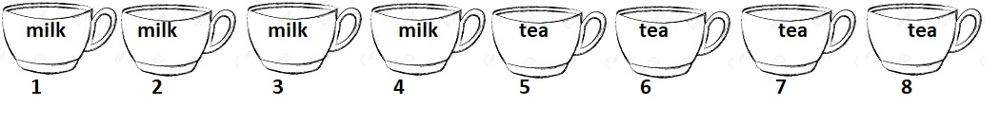

```{r setup, include=FALSE}
###this is a code chunk. you can write code here

###setting global option to echo all code chunks, unless
###otherwise specified in chunk options
knitr::opts_chunk$set(echo = TRUE)

###attach R packages which may be needed
library(openintro)    #contains R function for drawing probability tree

```


* * * 
\begin{shaded}

\textbf{Learning Outcomes}

The problems are designed to build conceptual understanding and problem-solving skills. The emphasis is on learning to find, evaluate and build confidence.
The specific tasks include: 

   - Enumerate and count
   
   - Apply Bayes' rule
   
   - Calculate probabilities for independent events
  
   - Back up and support work with relevant explanations


\end{shaded}

* * *

### Exercises 

1.  (*Lady Tasting Tea*) In a famous experiment conducted by Sir. R. A. Fisher, 8 cups of tea - 4 prepared by pouring the milk first and then the tea and 4 prepared by pouring the tea first and then the milk -- were  presented in random order to Muriel Bristol who claimed she could tell the difference. 

The methods employed in the experiment were fully disclosed to the subject and she had to select the 4 cups prepared with the "milk poured first". 


```{r teacups, echo=F, fig.align = "center", out.width="85%"}
#including an image file

```

  
  a. The sample space $S$ for this experiment consists of all groupings of 4 cups selected from eight. How many such groups are there? Write your answer symbolically first and also calculate it in the code chunk below.
  
  We have that the sample space is size $\binom{8}{4}$.
  
```{r count_s}
#calculate number of elements in S
## in the code chunk below
s_size <- choose(8, 4)
```

  We find that the size of $S$ is equal to `r s_size`.
  
  b. Let $E$ denote the event that there are 3 cups with "milk poured first" and 1 cup with "tea poured first". How many elements are in $E$? Write your answer symbolically first and also calculate it in a code chunk below.
  
  Let $|E|$ denote the cardinality of the set $E$. Then we have,
  $$|E| = \binom{4}{3} \times \binom{4}{1}$$
  
```{r answer_1b}
#calculate number of elements in E
e_size <- choose(4, 3) * choose(4, 1)
```

  We see that this is equal to `r e_size`.

 c. If the lady has no ESP and is just guessing randomly, it is reasonable to assume that every outcome in $S$ is equally likely. Calculate $P(E)$ under this assumption. You may do this in a code chunk.
 
```{r answer_1c}
# calculate P(E)
prob_E <- e_size / s_size
prob_E <- round(prob_E, 3)
```

  We see that $P(E) =$ `r prob_E`.


2. One common application of conditional probabilities is in calculating inverse probabilities. For example,
consider the following tree diagram of probabilities relating a screening test for a disease with the actual presence of disease. 


```{r treediagram, echo = FALSE}

treeDiag(main = c("Disease status", "Test result"),
         p1 = c(0.001, 0.999),
         p2 = list(c(0.98, "?"), c(0.01, "?")),
         out1 = c("Present", "Absent"),
         out2 = c("Positive", "Negative"),
         showSol = FALSE,
         showWork = FALSE,
         solwd = 0.5,
         digits = 6)

```

Let $D$ denote that a randomly selected individual has the disease, and $T$ the event that the screening test is positive. 

The first (primary) branch of the tree gives \emph{unconditional} probabilities of disease being present or absent:
$$P(D) = 0.001, P(D^{c}) = 0.999$$ 
while the secondary branches state conditional probabilities of the test coming out positive (or negative) given the disease status. For example, you are given that
$$P(T|D) = 0.98, P(T|D^{c}) = 0.01.$$

   a. Fill in the values in the tree diagram for the conditional probabilities $P(T^{c}|D)$ and $P(T^{c}|D^{c})$ indicated by a "?"  (Hint: conditional probability follows Law of Complements.)
   
   Here we are going to utilize the Law of Complements for each missing conditional probability:

```{r treediagram_filled_in, echo = FALSE}

treeDiag(main = c("Disease status", "Test result"),
         p1 = c(0.001, 0.999),
         p2 = list(c(0.98, 0.02), c(0.01, 0.99)),
         out1 = c("Present", "Absent"),
         out2 = c("Positive", "Negative"),
         showSol = FALSE,
         showWork = F,
         solwd = 0.5,
         digits = 6)

```


   b. Suppose the test is positive. What is the probability that the person actually has disease? In other words, find the inverse conditional probability: $P(D|T)$
   
  Hint: see example 4.2 from "Chapter 4: Conditional Probability"
  
  We can use Bayes' rule to write:
  
\begin{align*}
  P(D|T) &= \frac{ P(T|D) \times P(D) }{P(T)} \\
         &= \frac{ 0.98 \times 0.001 }{P(T)}
\end{align*}

  Now all that's left is to find $P(T)$. We need to add $P(D \cap T)$ and $P(D^c \cap T)$. We have:
\begin{align*}
  P(D \cap T) = P(T | D) \times P(D) = 0.98 \times 0.001 \\
  P(D^c \cap T) = P(T | D^c) \times P(D^c) = 0.01 \times 0.999
\end{align*}

```{r cal_inv_prob}
prob_T_given_D <- .98
prob_D <- 0.001
prob_T_given_Dc <- 0.01
prob_Dc <- 1 - prob_D

# use chain rule to find intersection probabilities
prob_D_and_T <- prob_T_given_D * prob_D
prob_Dc_and_T <- prob_T_given_Dc * prob_Dc
prob_T <- prob_D_and_T + prob_Dc_and_T

prob_D_given_T <- (prob_T_given_D * prob_D) / prob_T
print(prob_D_given_T)
```

  Using the above math we have that $P(D|T) =$ `r round(prob_D_given_T, 4)`.
 


3. Suppose that string of tree lights you just bought has twenty-four bulbs
wired in series. If each bulb has a 99.9% chance of “working” when the current
is applied, what is the probability that the string itself will not work? You may assume that bulb failures are independent.

  Let $A_i$ be the event that bulb $i$ works. Let $B$ be the event that the string of lights works (i.e. no bulbs are out). Then,
  $$B = A_1 \cap A_2 \cap \dots \cap A_{24}$$
  
  By independence of the $A_i$'s we have that 
  $$P(B) = P(A_1) \times P(A_2) \times \dots \times P(A_{24})$$
  
  In other words, $P(B) = (0.999)^{24}$, which works out to be `r round((0.999)^(24), 4)`. Thus, the probability that the string will not work is `r 1 - round((0.999)^(24), 4)`.

